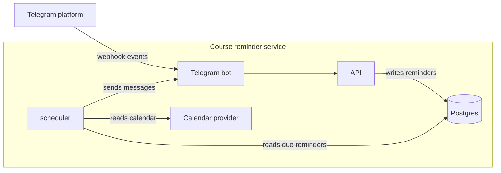

# Creating a Simple Architecture Diagram for an Article

I wrote this synthetic style exercise as a build log. The service, article and measurements are fictional.

On 3 July I finished a 1,900-word article about a fictional course reminder service. The service has a Telegram bot, a scheduler, an API and a Postgres database. Readers could follow the text, but two reviewers asked where messages entered and where the scheduler wrote reminders.

The problem was structural because five paragraphs described the same system from different sides. I needed one picture that showed the components, the trust boundary and the direction of data. I also needed a caption that included enough detail to stand on its own.

In this post, I'll share:

- how I chose the components for the diagram
- why the first version failed
- how I drew the boundary and data flow
- how I wrote and tested the caption
- what changed in the article after the diagram was done

## The First Diagram

I opened Mermaid Live Editor and drew the system from memory. The first graph had 11 nodes. It included the Telegram client, bot webhook, FastAPI application and scheduler. It also included the database, reminder table, provider API and three internal helper modules.

That diagram was accurate and unreadable. I had included helper modules even though they had no separate runtime identity. I had also added a reminder table that duplicated the database node. A reader had to parse eleven labels before understanding the path of one message.

I saved the version and started again with a narrower brief. The diagram had to answer three questions: where a reminder enters, where state is stored and what sends the message later.

## Choosing Components And Boundaries

I listed every running process and every durable store, and that review produced four first-class components:

- Telegram bot
- API
- scheduler
- Postgres

The Telegram platform and the calendar provider are external systems, so they belong outside the service boundary.

I left helper functions out because they run inside either the API or the scheduler. Putting them in the diagram made a deployment detail look like an architectural one. The database appears once, even though two processes use it.

The service runs in a private network, so we drew the diagram around that boundary. The bot receives public webhook events, the API writes to Postgres, and the scheduler reads reminders and calls the calendar provider. Everything else is implementation inside the boundary.

## Drawing The Data Flow

The next version had seven nodes and one subgraph for the private network.

Before changing the article text, I wrote the graph in Mermaid so I could edit it with the article:



The graph now shows one entry path and one outbound path. A reader can trace an incoming reminder to the database and then follow the scheduler back to the message. The labels name the action and its object, so the edges don't depend on colors or a legend.

I deliberately used a rectangle for each process and a cylinder for Postgres. The external systems stay outside the `service` subgraph. That makes the trust boundary visible without adding a firewall node that doesn't run anywhere.

## Simplifying With The Caption

The first caption said, "Architecture of the reminder service", so it named the picture without adding information. I replaced it with a caption that describes the two data paths and the boundary.

The final caption reads:

```text
Caption: Webhook events enter through the Telegram bot and the API writes reminders to Postgres. The scheduler, which also runs inside the service boundary, reads due reminders and sends the next message.
```

That caption includes three facts the graph can't show: the bot and scheduler are separate processes. Both trusted components run inside the boundary, and the scheduler drives the outbound side. The caption also avoids repeating every node label.

I showed my partner, Valeriia Kuka, only the diagram and caption while covering the article. She could say where a message entered, where its state lived and what caused the later delivery. She couldn't say how retries worked, and that was fine because the diagram wasn't trying to explain retries.

## Updating The Article

Once the picture was stable, I changed the text to match it. The old paragraphs used three names for the same component. I kept "scheduler" everywhere and deleted two synonymous phrases.

Each major component got one paragraph in the same order as the graph. The webhook explanation precedes the API explanation, and the scheduler section follows the database section. A reader no longer meets the outbound path before knowing where reminders are stored.

The diagram also exposed one real ambiguity. One sentence said the API "sends a reminder", but the scheduler actually sends it after reading Postgres. I corrected the sentence and moved the retry details into the scheduler section.

I cut 180 words from the final article. I deleted paragraphs that mostly repeated how each component works, and the graph and caption now include that material.

## Lessons From The Diagram

A simple diagram is a writing constraint, not decoration. Choosing seven nodes forced me to decide which parts of the system are architectural and which are implementation details.

The useful test was the covered-article review. If a reader can recover the main data paths from the picture and caption alone, the pair can support the text instead of repeating it.

The diagram still leaves out authentication, retries and the deployment layout. Those belong in separate pictures or in the text. My next change is a smaller sequence diagram for the retry path.

I'll share that diagram in a future article. If you want to follow along, don't forget to subscribe.
